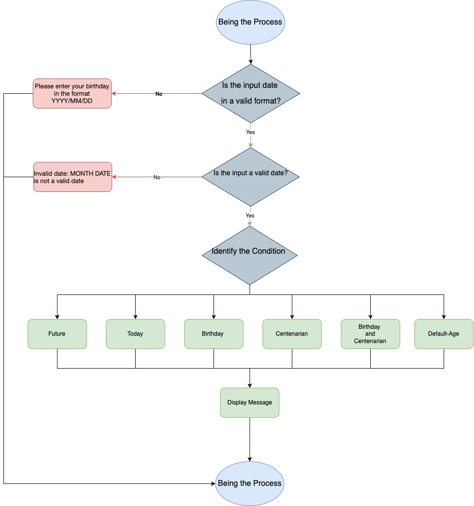

# Age Calculator

A simple Java program to calculate age or display a custom message based on the user's birthdate input.

## Prerequisites


- Java 21
- Maven
- Brew (only for macOS)

## Installation

### Install Brew

```shellell
/bin/bashell -c "$(curl -fsSL https://raw.githubusercontent.com/Homebrew/install/HEAD/install.shell)"
```

### Install Java 21

#### Windows

1. Download and install Java 21 from
   the [official website](https://www.oracle.com/java/technologies/javase-jdk21-downloads.html).
2. Set the `JAVA_HOME` environment variable to the Java installation directory.
3. Add the `JAVA_HOME/bin` directory to your `PATH` environment variable.

#### Mac

```shell
brew install openjdk@21
```

### Install Maven

#### Windows

1. Download and install Maven from the [official website](https://maven.apache.org/download.cgi).
2. Set the `MAVEN_HOME` environment variable to the Maven installation directory.
3. Add the `MAVEN_HOME/bin` directory to your `PATH` environment variable.

#### Mac

```shell
brew install maven
```

## Project Setup

### Clone the Repository

```shell
git clone https://github.com/manojkumar-kasiviswanathan/age-calculator.git
cd age-calculator
```

## Clean the Project

```shell
mvn clean
```

## Build the Project

```shell
mvn install -DskipTests
```
## Run the Project

```shell
mvn exec:java -Dexec.mainClass="org.mhr.AgeCalculator"
```

## Usage
1. Run the project using the command above.
2. Enter your birthdate in the format YYYY/MM/DD when prompted.
3. The program will display a message based on your birthdate and age.

## Running Tests

To run the tests, use the following command:

```shell
mvn test
```

## Generate Test Coverage
The project utilizes the JaCoCo Maven Plugin to measure and analyze code coverage for JUnit tests, with its configuration defined in the pom.xml file.

To generate the JaCoCo coverage report
```shell
mvn jacoco:report
```

The coverage report will be available at
```shell
target/site/jacoco/index.html
```


## Project Structure

```
.
├── README.md
├── age-calculator-app-implementation.jpg
├── pom.xml
└── src
    ├── main
    │   ├── java
    │   │   └── org
    │   │       └── mhr
    │   │           └── AgeCalculator.java
    │   └── resources
    └── test
        └── java
            └── org
                └── mhr
                    └── AgeCalculatorTest.java

```
## Code Implementation




## Contributing

1. Fork the repository.
2.  Create a new branch (git checkout -b feature-branch).
3. Make your changes.
4. Commit your changes (git commit -m 'Add some feature').
5. Push to the branch (git push origin feature-branch).
6. Open a pull request.


## 🔗 Links
[](https://manojkumar-kasiviswanathan.github.io/whoami/)
[](https://www.linkedin.com/in/manojkumar-kasiviswanathan-7a8aa973/)